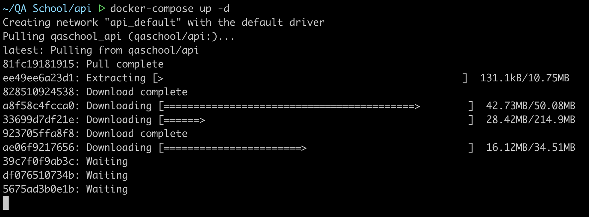
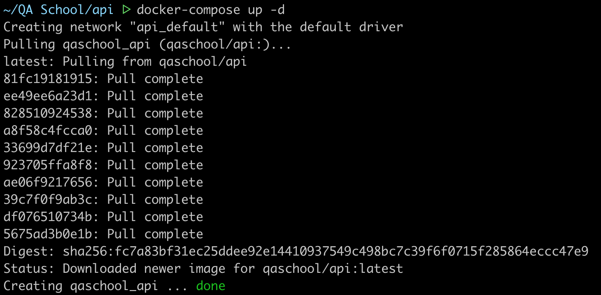
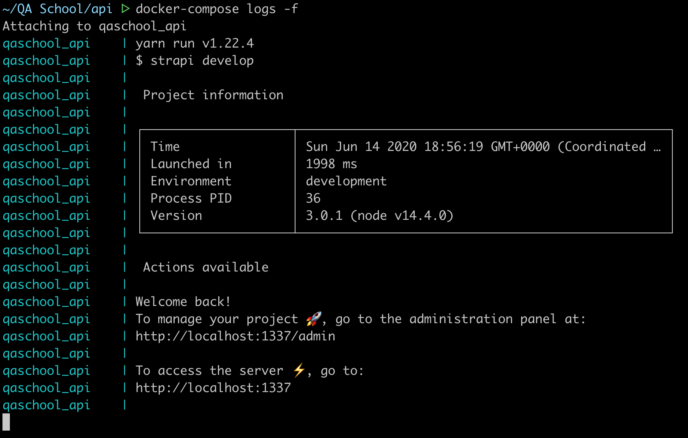

# QA School - API

Este repositório é utilizado nos cursos de API da QA School.

## :hammer_and_wrench: SETUP

> Pré-requisitos:

- Instalar o Docker + Docker-Compose

  - [MacOS](https://github.com/qaschoolbr/setup/blob/master/macos/docker/README.md)
  - [Linux](https://github.com/qaschoolbr/setup/blob/master/linux/docker/README.md)
  - [Windows Home](https://github.com/qaschoolbr/setup/blob/master/windows/docker/toolbox/README.md)
  - [Windows Pro/Enterprise/Education](https://github.com/qaschoolbr/setup/blob/master/windows/docker/desktop/README.md)

### :octocat: Clonar Repositório

```bash
git clone https://github.com/qaschoolbr/api.git
```

> Caso utilize o HUB basta rodar `hub clone qaschoolbr/postman`

Entre no diretório criado com o comando:

```bash
cd api/
```

### :whale: Instanciar a API

Execute o comando abaixo para subir a stack e aguarde o download da imagem `qaschool/api`:

```bash
docker-compose up -d
```



Quando a imagem for baixada, o container será instanciado:



### :memo: Verificar Log

Execute o comando abaixo para verificar o log em tempo real:

```bash
docker-compose logs -f
```



Quando o log exibir **Welcome Back**, basta usar a combinação de teclas <kbd>CTRL</kbd> + <kbd>C</kbd> para sair do log.

## :rocket: API no Ar

Acesse o painel via [localhost:1337](http://localhost:1337) para conferir se está tudo OK mesmo.

---

[Conheça o layout da API (Endpoints e Atributos)](./api.md)